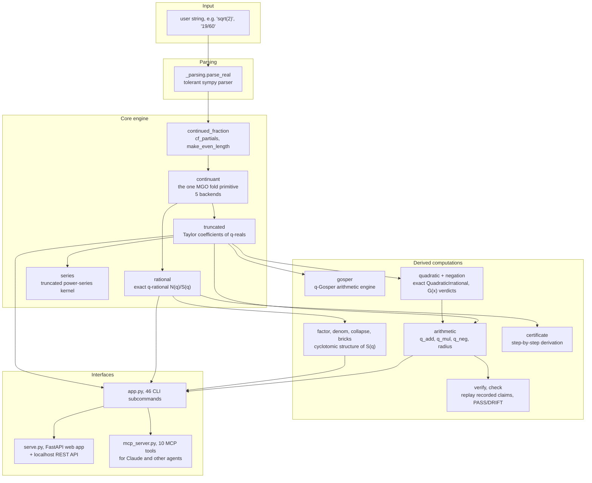
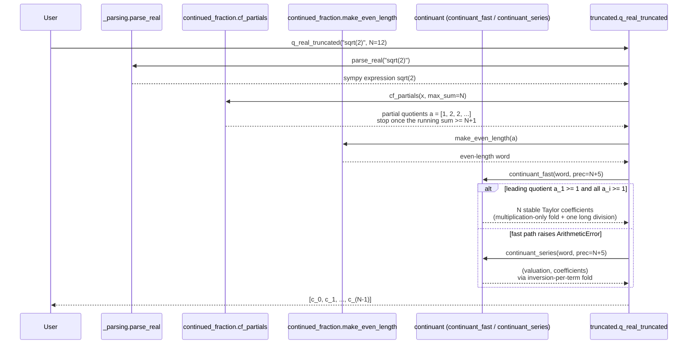

# How qreals works

This is a from-zero explanation of what qreals computes and how the code is
built. It assumes no prior knowledge of q-deformed numbers.

## 1. What a q-deformed number is

Take an ordinary positive rational number, say 19/60. A q-deformation
replaces it with a ratio of two polynomials in a new variable `q`,

    [19/60]_q = N(q) / S(q)

built so that setting q = 1 collapses N(q)/S(q) back to 19/60 exactly. The
same idea extends to any positive real number x: instead of a ratio of two
finite polynomials, you get a ratio of two power series, and the first N
Taylor coefficients of that series are computable exactly for any N.

The construction is due to Sophie Morier-Genoud and Valentin Ovsienko (MGO):
q-deformed rationals from the continued fraction of a rational number, and
q-deformed reals as the limit of the q-deformed convergents of a real number
(qreals README, "What it does").

### 1.1 q-integers

The building block is the q-integer

    [n]_q = 1 + q + q^2 + ... + q^(n-1)

which specializes to the ordinary integer n at q = 1. Run it:

    $ qreals qint 4
    [4]_q = q**3 + q**2 + q + 1
    [4]_(q^-1) = (q**3 + q**2 + q + 1)/q**3
    [n]_q at q = 1: 4   (= 4)

(src/qreals/continuant.py:65, `q_int`)

### 1.2 q-rationals from continued fractions

Every positive rational p/s has a regular continued fraction expansion
`[a_1, a_2, ..., a_k]`. The MGO formula folds this continued fraction into a
2x2 matrix product where each partial quotient `a_i` contributes a q-integer
block, alternating between `[a_i]_q` at odd positions and `[a_i]_{1/q}` at
even positions (src/qreals/continuant.py:1-40, module docstring). The
first-column ratio of the resulting matrix is the exact rational function
`[p/s]_q = N(q)/S(q)`.

The formula is only stated for an even-length continued fraction. A regular
continued fraction from the Euclidean algorithm can come out odd-length, so
it is rewritten first: splitting the final term `a_k >= 2` into
`a_k - 1, 1`, or absorbing a trailing 1 into the term before it
(src/qreals/continued_fraction.py:67, `make_even_length`).

Example:

    $ qreals denom 4/15 --json
    {
      "a": 4, "d": 15, "cf": [0, 3, 1, 3],
      "N": "1 + q + q^2 + q^3",
      "S": "1 + 2*q + 3*q^2 + 3*q^3 + 3*q^4 + 2*q^5 + q^6",
      "S_factored": "Phi_3 * Phi_5",
      ...
    }

### 1.3 q-reals and Taylor coefficients

For an irrational (or any real where the exact rational function is not
wanted), the continued fraction does not terminate. qreals instead computes
partial quotients until enough of them have accumulated to guarantee a fixed
number of stable coefficients, then folds only that finite word.

The stopping rule comes from MGO's own stabilization result: stopping the
continued fraction at the first depth n where the partial-quotient sum
`S_n = a_1 + ... + a_n` reaches at least `N + 1` fixes at least N stable
power-series coefficients of `[x]_q` (src/qreals/continued_fraction.py:41-53,
`cf_partials`).

Example, the first 12 coefficients of `[sqrt(2)]_q`:

    $ qreals coeffs "sqrt(2)" 12
    [sqrt(2)]_q = 1 + q^3 - 2*q^5 + q^6 + 4*q^7 - 5*q^8 - 7*q^9 + 18*q^10 + 7*q^11 + O(q^12)
    power q^k  coefficient c_k
    ---------  ---------------
    q^0        1
    q^1        0
    q^2        0
    q^3        1
    q^4        0
    q^5        -2
    ...

(src/qreals/truncated.py:33, `q_real_truncated`)

## 2. Why exact arithmetic, not floating point

Every coefficient qreals reports is an exact integer, computed by polynomial
and big-integer arithmetic (sympy `Poly` / `Matrix` objects over `Z` or
`Z[q, q^-1]`), never a float. Two reasons this matters for what the package
is used for:

- **Divisibility questions are exact-or-nothing.** Whether a cyclotomic
  factor `Phi_e(q)` divides the denominator `S(q)` of `[a/d]_q`
  (`qreals denom`, `qreals collapse`) is a yes/no fact about integer
  polynomials. A floating-point coefficient that is "close to zero" gives no
  answer to that question at all.
- **A single rounding bug can silently reclassify a huge number of cases at
  once**, because a threshold test (`abs(c) < epsilon`) near-misses a case
  differently at every precision. Exact arithmetic replaces that with an
  integer comparison that cannot drift.

The one place floating point appears at all is `radius_estimate` / `radius`,
a running-max root-test *estimate* of the radius of convergence from a
finite coefficient window; it is explicitly documented as a biased estimate,
not an exact value (src/qreals/arithmetic.py:216-237, `radius_from_coeffs`,
`radius`).

## 3. Package architecture

Every feature is reachable through the same three surfaces: a plain Python
function, a `qreals` CLI subcommand, and a card in `qreals serve` (README,
"Every feature below is reachable three ways"). The MCP server is a thin
wrapper over the same functions: "every tool is a thin wrapper over an
existing engine function, so the numbers an MCP client sees are the same
numbers the CLI and the test suite see" (src/qreals/mcp_server.py:1-16,
module docstring).

## 4. Computing a q-real's Taylor coefficients, step by step

The fold itself (`continuant`) is one recurrence with five interchangeable
backends for different representations: a literal symbolic matrix product
(`continuant_matrix`), a polynomial-only scaled version
(`continuant_pair`), a cancelled symbolic ratio (`continuant_symbolic`), a
truncated-series fold with one series inversion per term
(`continuant_series`), and a multiplication-only fold with a single final
long division (`continuant_fast`) (src/qreals/continuant.py:1-40). The
truncated-series path (`continuant_fast`) is measured about 300x faster than
the inversion-per-term fold at depth 512 (README, "What it does"), and is
tried first; `q_real_truncated` falls back to `continuant_series` only when
`continuant_fast` raises `ArithmeticError` (src/qreals/truncated.py:60-80).

## 5. Module-by-module walkthrough

| Module | What it owns | Key entry point |
|---|---|---|
| `_parsing.py` | Tolerant parsing of user strings (`3sqrt(2)`, `2pi`) into sympy expressions | `parse_real` (`_parsing.py:1-30`) |
| `continued_fraction.py` | Partial quotients of x up to a stopping bound; even-length normalisation | `cf_partials` (`continued_fraction.py:46`), `make_even_length` (`continued_fraction.py:67`) |
| `continuant.py` | The single MGO fold recurrence, five backends | `q_int` (`continuant.py:65`), `continuant_series` (`continuant.py:220`), `continuant_fast` (`continuant.py:329`) |
| `rational.py` | Exact q-rational `[p/s]_q` as a symbolic ratio | `q_rational` (`rational.py:62`) |
| `truncated.py` | Taylor coefficients of `[x]_q` for any real x | `q_real_truncated` (`truncated.py:33`) |
| `series.py` | The truncated power-series kernel (add, multiply, invert) used by `continuant_series` | - |
| `arithmetic.py` | Series sum/product of two q-reals (not the q-deformation of the sum/product), q-negation, radius estimate | `q_add`, `q_mul` (`arithmetic.py:96,109`), `q_neg` (`arithmetic.py:146`) |
| `gosper.py` | The q-Gosper algorithm, an independent route to the same sum/product, used as a cross-check | - |
| `quadratic.py` | Exact arithmetic on `x = (p + r*sqrt(D))/s` (no floats), Hirzebruch-Jung continued fractions | `QuadraticIrrational` |
| `negation.py` | `G(x) = [x]_q + [-x]_q`, finite/infinite verdicts for rational and quadratic x | `negation_sum_exact` |
| `factor.py`, `denom.py`, `collapse.py`, `bricks.py` | Cyclotomic factorisation of the denominator `S(q)` | `qreals denom`, `qreals collapse`, `qreals bricks` |
| `certificate.py` | Step-by-step, human-auditable derivation (not a machine proof) | `qreals certify` |
| `verify.py`, `check.py` | Replay recorded claim files and report PASS/DRIFT against current output | `qreals check` |
| `mcp_server.py` | Model Context Protocol server: 10 tools, 3 catalog resources, thin wrappers over the engine | `qreals mcp` |
| `app.py` | The CLI entry point, 46 subcommands | `qreals <command>` |
| `serve.py`, `web/` | Local FastAPI web app and REST API (`/api/v1/compute`) | `qreals serve` |

## 6. Tests

This public repository does not include a `tests/` directory: `qreals`'
build configuration excludes the test suite from the published source
distribution by design (`pyproject.toml`, `[tool.hatch.build.targets.sdist]`,
`only-include = ["src/qreals", "README.md", "LICENSE", "pyproject.toml"]`),
and the GitHub repository itself (`git ls-files`, checked 2026-09-28) carries
no `tests/` directory and no CI workflow. The README's "At a glance" table
reports 536 `def test_` functions, but that count is generated from a
development tree that is not part of this published repository, so it
cannot be reproduced or verified from what is here. The correctness
guarantees described in this document (for example, that `continuant_fast`
and `continuant_series` agree, or that a rational's truncated series matches
its exact rational function) are the properties that suite is designed to
check, in the development tree; a reader of the public repository can verify
the engine directly instead, by running the CLI's own worked examples, which
is what every worked example in this document does. `qreals check
--show-schema` and the `qreals denom` / `qreals conj` worked examples above
were each re-run against this repository's code to confirm their output
matches what is printed here.

## 7. Glossary

| Term | Meaning |
|---|---|
| q-deformation, `[x]_q` | A rational function or power series in q that specializes to x at q = 1. |
| q-integer, `[n]_q` | `1 + q + ... + q^(n-1)`, the q-analog of the integer n. |
| q-rational | `[p/s]_q`, the exact rational function in q for a rational p/s. |
| q-real | `[x]_q` for a real x: the limit of the q-rationals of the continued-fraction convergents of x, as a power series. |
| MGO | Sophie Morier-Genoud and Valentin Ovsienko, the authors of the q-deformed rational and q-deformed real construction this package implements. |
| Continued fraction (regular) | The expansion `x = a_1 + 1/(a_2 + 1/(a_3 + ...))`, written `[a_1, a_2, a_3, ...]`. |
| Even-length normalisation | Rewriting an odd-length regular continued fraction into an equal-value even-length one, which the MGO formula requires. |
| Laurent series/polynomial | A series or polynomial allowing negative powers of q, as arises for `[x]_q` when x is negative. |
| Cyclotomic polynomial, `Phi_e(q)` | The minimal polynomial of a primitive e-th root of unity; a recurring factor of the denominator `S(q)` of a q-rational. |
| Exact arithmetic | Computation with integers and exact polynomial coefficients, never floating-point approximation. |

## References

- Morier-Genoud, S. and Ovsienko, V. The construction implemented here.
  See the package's own citation in `README.md`, "What it does".
- `README.md` in this repository: feature list, CLI reference, and the
  MCP/agent usage section.
